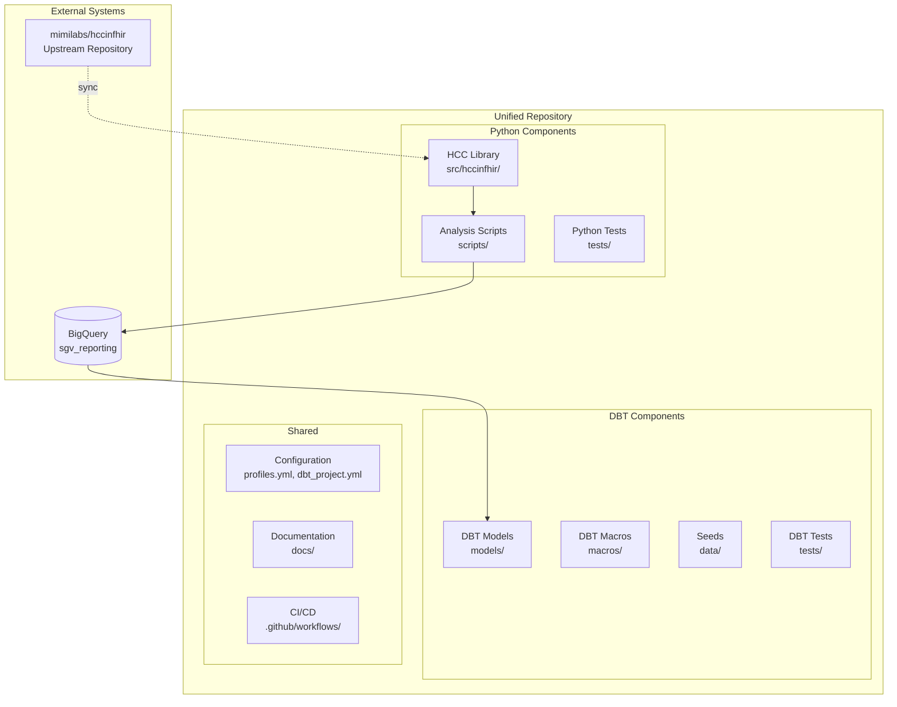
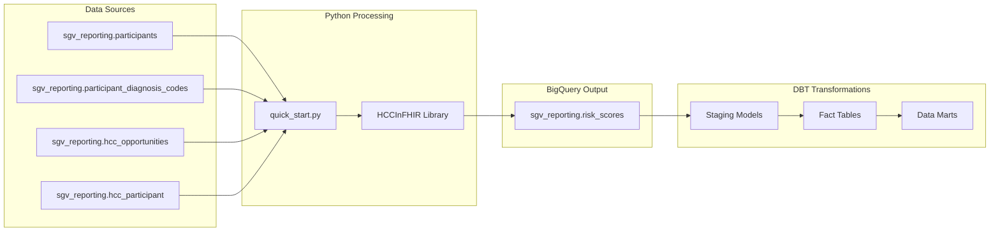
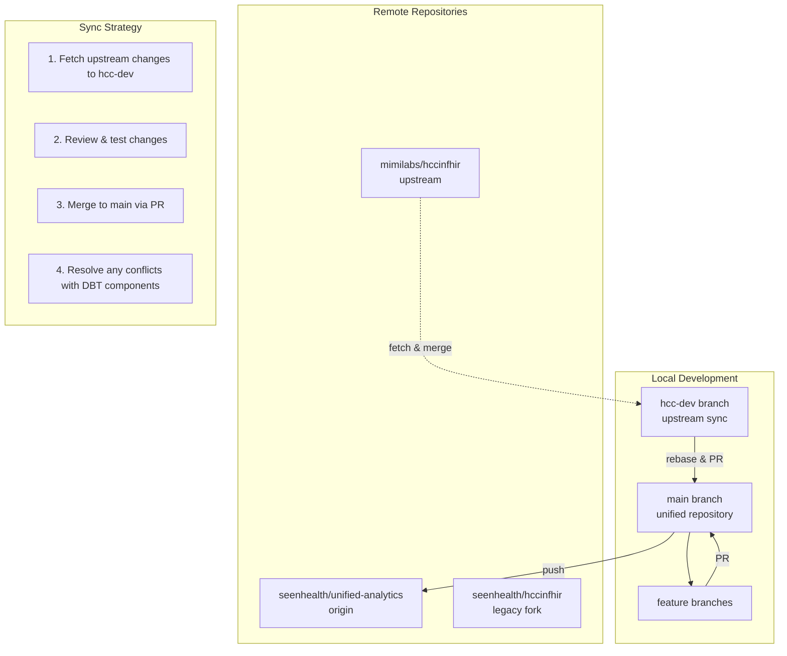
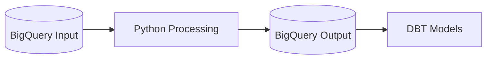
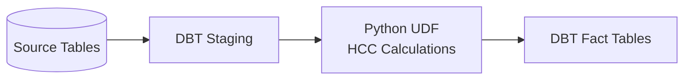
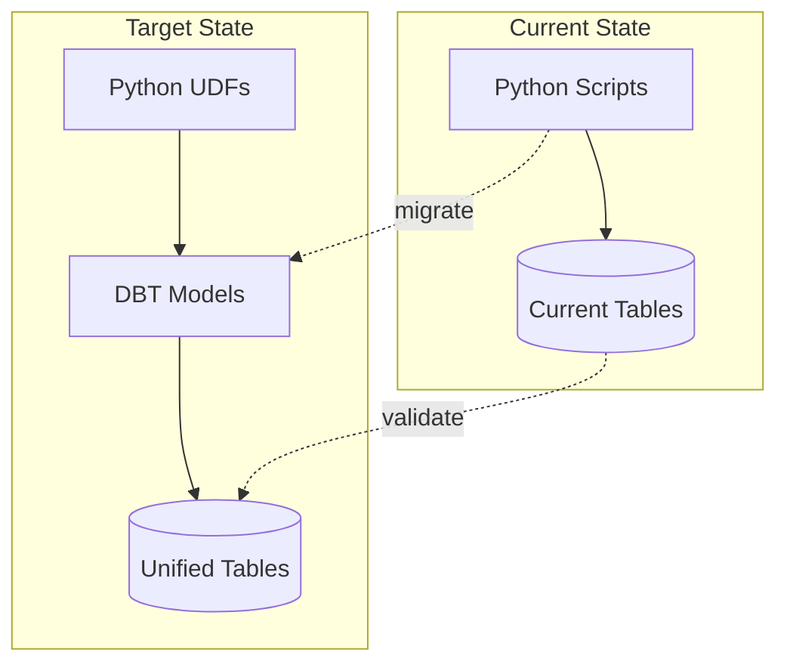

# HCCInFHIR & DBT Analytics Repository Integration Proposal

## Executive Summary

This proposal outlines a comprehensive strategy for integrating the HCCInFHIR Python library with the existing DBT analytics repository to create a unified data analytics platform. The integration will leverage BigQuery as the common data layer while maintaining synchronization with the upstream HCCInFHIR repository (mimilabs/hccinfhir).

### Key Benefits
- **Unified Analytics Platform**: Single repository for all healthcare analytics workflows
- **Seamless Data Pipeline**: Direct integration between HCC calculations and DBT models
- **Maintained Open Source Sync**: Continued ability to pull/push changes to upstream repository
- **Scalable Architecture**: BigQuery-native processing with Python UDFs and DBT transformations

## Current State Analysis

### HCCInFHIR Repository (Current)
- **Source**: Forked from `mimilabs/hccinfhir`
- **Core Function**: HCC risk adjustment score calculations
- **Data Sources**: FHIR resources, X12 837 claims, CMS encounter data
- **BigQuery Integration**: Reads from `sgv_reporting.participants` and `sgv_reporting.participant_diagnosis_codes`
- **Output**: Writes to `sgv_reporting.risk_scores` table
- **Package Management**: UV-based Python environment
- **Testing**: Comprehensive pytest suite

### DBT Analytics Repository (Target)
- **Core Function**: Data transformations and analytics workflows
- **Platform**: BigQuery-native with extensive existing pipelines
- **Integration Points**: Multiple data sources and transformation layers
- **CI/CD**: Established deployment pipelines

## Proposed Architecture

### High-Level Integration Strategy



### Data Flow Architecture



## Git Strategy for Upstream Synchronization

### Repository Structure



### Synchronization Workflow

1. **Regular Upstream Sync**
   ```bash
   # Create dedicated branch for upstream changes
   git checkout -b hcc-upstream-sync
   git fetch upstream
   git merge upstream/main

   # Test HCC functionality
   uv run -m pytest tests/
   uv run scripts/quick_start.py -q

   # Create PR to main
   gh pr create --title "Sync with upstream HCCInFHIR" --body "Updates from mimilabs/hccinfhir"
   ```

2. **Contributing Back to Upstream**
   ```bash
   # Create feature branch from clean HCC code
   git checkout -b feature/contribution upstream/main
   # Make changes
   git push origin feature/contribution
   # Create PR to upstream
   gh pr create --repo mimilabs/hccinfhir
   ```

## Integration Patterns

### 1. Python-First Pattern (Current Quick Start)


**Implementation:**
- Keep existing `quick_start.py` functionality
- Enhance with DBT model triggers
- Add data quality checks

### 2. DBT-Native Pattern (Recommended)


**Implementation:**
- Create BigQuery UDFs from HCC library
- Embed in DBT models as custom functions
- Native SQL performance with Python logic

### 3. Hybrid Pattern (Migration Path)


## Proposed Directory Structure

```
unified-analytics-repo/
├── README.md
├── CLAUDE.md                          # Updated with DBT commands
├── pyproject.toml                     # Python package config
├── dbt_project.yml                    # DBT project config
├── profiles.yml                       # BigQuery connection profiles
│
├── src/
│   └── hccinfhir/                     # HCC Python library (preserved)
│       ├── __init__.py
│       ├── hccinfhir.py
│       ├── model_*.py
│       └── data/                      # CSV coefficient files
│
├── scripts/                           # Analysis and utility scripts
│   ├── quick_start.py                 # Enhanced for DBT integration
│   ├── hcc_udfs.py                    # BigQuery UDF generation
│   └── data_validation.py             # Cross-platform validation
│
├── models/                            # DBT models
│   ├── staging/
│   │   ├── stg_participants.sql
│   │   ├── stg_diagnosis_codes.sql
│   │   └── stg_hcc_raw_scores.sql
│   ├── intermediate/
│   │   ├── int_hcc_calculations.sql   # Uses Python UDFs
│   │   └── int_risk_adjustments.sql
│   └── marts/
│       ├── fact_patient_risk_scores.sql
│       └── dim_hcc_hierarchies.sql
│
├── macros/                            # DBT macros
│   ├── hcc_macros.sql                 # HCC-specific transformations
│   └── data_quality_macros.sql
│
├── tests/                             # Combined test suite
│   ├── python/                        # Python tests (preserved)
│   │   ├── test_hccinfhir.py
│   │   └── test_*.py
│   └── dbt/                          # DBT tests
│       ├── data_quality/
│       └── business_logic/
│
├── docs/                              # Combined documentation
│   ├── hcc_integration_guide.md
│   ├── dbt_model_documentation.md
│   └── api_reference.md
│
├── .github/
│   └── workflows/
│       ├── python_tests.yml           # HCC library CI
│       ├── dbt_tests.yml              # DBT model CI
│       ├── integration_tests.yml      # End-to-end validation
│       └── upstream_sync.yml          # Automated upstream sync
│
└── deployment/
    ├── bigquery_udfs/                 # Generated UDF deployment scripts
    ├── dbt_profiles/                  # Environment-specific profiles
    └── migration_scripts/             # Data migration utilities
```

## Implementation Roadmap

### Phase 1: Repository Consolidation (Week 1-2)
- [ ] Create new unified repository structure
- [ ] Migrate HCC library preserving git history
- [ ] Set up dual remote configuration (upstream sync)
- [ ] Establish CI/CD for both Python and DBT components
- [ ] Create initial DBT staging models for existing tables

### Phase 2: Integration Development (Week 3-4)
- [ ] Convert core HCC functions to BigQuery UDFs
- [ ] Create DBT intermediate models using UDFs
- [ ] Develop data validation framework
- [ ] Implement cross-platform testing
- [ ] Document integration patterns

### Phase 3: Migration & Validation (Week 5-6)
- [ ] Parallel run both systems
- [ ] Validate output consistency
- [ ] Performance optimization
- [ ] Create migration scripts for dependent systems
- [ ] Update documentation and training materials

### Phase 4: Production Deployment (Week 7-8)
- [ ] Deploy unified system to production
- [ ] Monitor performance and data quality
- [ ] Decommission legacy processes
- [ ] Establish ongoing maintenance procedures
- [ ] Set up automated upstream synchronization

## Risk Mitigation

### Technical Risks
1. **Merge Conflicts**: Automated testing and staged integration
2. **Performance Degradation**: Parallel validation and optimization
3. **Data Quality Issues**: Comprehensive validation framework
4. **Upstream Sync Complexity**: Dedicated sync branch and automated testing

### Operational Risks
1. **Team Training**: Comprehensive documentation and training sessions
2. **Deployment Complexity**: Phased rollout with rollback procedures
3. **Dependency Management**: Clear separation of Python and DBT dependencies

## Success Metrics

- **Development Efficiency**: Reduced time to deploy HCC-related analytics
- **Data Consistency**: 100% validation between Python and DBT outputs
- **Upstream Sync Health**: Successful monthly sync with upstream repository
- **Performance**: Sub-minute execution for full patient cohort processing
- **Code Quality**: Maintained test coverage >90% for both Python and DBT

## Conclusion

This integration strategy provides a path to unify HCC analytics capabilities with the existing DBT framework while maintaining connection to the open-source community. The phased approach minimizes risk while delivering immediate value through improved development workflows and data consistency.

The proposed architecture leverages the strengths of both systems: Python's computational flexibility for complex HCC algorithms and DBT's transformation capabilities for scalable data processing. By maintaining upstream synchronization, the team can contribute back to the open-source project while building specialized analytics capabilities.

---

**Next Steps:**
1. Review and approve this proposal with the team
2. Set up initial repository structure
3. Begin Phase 1 implementation
4. Establish regular sync schedule with upstream repository

**Document Version:** 1.0
**Last Updated:** 2025-09-25
**Authors:** Claude Code
**Reviewers:** [To be filled in by team]